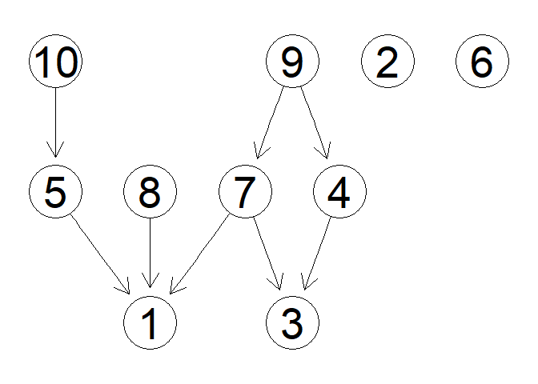

<!-- README.md is generated from README.Rmd. Please edit that file -->

# bcd-ugi

<!-- badges: start -->
<!-- badges: end -->

This directory contains the `R` code to implement the methodology
presented in the paper *Bayesian causal discovery from unknown general
interventions*, which will be soon made available as an ArXiv.

In particular, the script `learn_DTP.R` contains a function implementing
Algorithm $5$ of the same paper. The sub-directory `Auxiliary functions`
contains a plethora of internal functions.

In what follows, we illustrate the usage of `learn_DTP` through an
example. To replicate this example, clone the repository, set it as
working directory and run the script `Example.R`.

Sometime in the future, this code will be re-organised as an `R` package
with proper documentation.

## Example

In this example, we use our method on a combination of observational and
experimental Gaussian data. `learn_DTP` is used to learn the DAG, the
set of target nodes and the intervention-induced parent sets.

### Generate Gaussian DAGs and data

We first randomly generate a DAG `DAG1` with $q = 10$ nodes and
probability of edge inclusion $\omega = 0.2$.

``` r
q <- 10
w <- 0.2
DAG1 <- matrix(0,q,q)
set.seed(1)
DAG1[lower.tri(DAG1)] <- sample(c(0,1), q*(q-1)/2, T, prob = c(1-w, w))
```

The resulting DAG is shown in the following figure.

``` r
gRbase::plot(as(DAG1, "graphNEL"))
```



Then, we generate the Cholesky parameters of the Gaussian DAG-model and
obtain the corresponding covariance matrix.

``` r
set.seed(1)
L1 <- runif(q^2, 0.3, 1)*sample(c(-1,1), q^2, T)*DAG1
L1 <- L1 + diag(1,q)
D1 <- diag(1,q)
Sigma1 <- crossprod(solve(L1))
```

The post intervention DAG is obtained by modifying the parent set of the
target node $4$, adding the edges $2 \to 4$ and $6 \to 4$.

``` r
DAG2 <- DAG1
DAG2[2,4] <- DAG2[6,4] <- 1
gRbase::plot(as(DAG2, "graphNEL"))
```


The associated parameters are the same as before, except for the new
parents of the intervened node.

``` r
L2 <- L1
set.seed(2)
L2[c(2,6,9),4] <- runif(3, 0.3, 1)*sample(c(-1,1), 3, T)
D2 <- D1
Sigma2 <- crossprod(solve(L2))
```

We can then generate the data:

``` r
n <- 500
set.seed(1)
X1 <- mvtnorm::rmvnorm(n, sigma = Sigma1)
X2 <- mvtnorm::rmvnorm(n, sigma = Sigma2)
data <- list(X1, X2)
```

### Use `learn_DTP()`

We first set the hyperparameters of the prior distributions to make them
as weakly informative as possible.

``` r
  ## Parameter prior
DW_a <- q-1+1/n
DW_U <- diag(1,q)
  ## Induced parents prior
a_phi = b_phi = 1
  ## Targets prior
a_eta = b_eta = 1
  ## DAG prior
a_pi = b_pi = 1
```

We can then run our MCMC to obtain a posterior sample of size
`S = 5000`, after discarding the first `burn = 2000` observations. We
set the starting point to be the empty DAG.

``` r
S = 5000
burn = 2000
initial_DAG <- matrix(0,q,q)
out <- learn_DTP(S, burn, data, initial_DAG, 
                 DW_a, DW_U, a_phi, b_phi, a_eta, b_eta, a_pi, b_pi, fast = TRUE)
#> 
#>   |                                                                              |                                                                      |   0%  |                                                                              |                                                                      |   1%  |                                                                              |=                                                                     |   1%  |                                                                              |=                                                                     |   2%  |                                                                              |==                                                                    |   2%  |                                                                              |==                                                                    |   3%  |                                                                              |==                                                                    |   4%  |                                                                              |===                                                                   |   4%  |                                                                              |===                                                                   |   5%  |                                                                              |====                                                                  |   5%  |                                                                              |====                                                                  |   6%  |                                                                              |=====                                                                 |   6%  |                                                                              |=====                                                                 |   7%  |                                                                              |=====                                                                 |   8%  |                                                                              |======                                                                |   8%  |                                                                              |======                                                                |   9%  |                                                                              |=======                                                               |   9%  |                                                                              |=======                                                               |  10%  |                                                                              |=======                                                               |  11%  |                                                                              |========                                                              |  11%  |                                                                              |========                                                              |  12%  |                                                                              |=========                                                             |  12%  |                                                                              |=========                                                             |  13%  |                                                                              |=========                                                             |  14%  |                                                                              |==========                                                            |  14%  |                                                                              |==========                                                            |  15%  |                                                                              |===========                                                           |  15%  |                                                                              |===========                                                           |  16%  |                                                                              |============                                                          |  16%  |                                                                              |============                                                          |  17%  |                                                                              |============                                                          |  18%  |                                                                              |=============                                                         |  18%  |                                                                              |=============                                                         |  19%  |                                                                              |==============                                                        |  19%  |                                                                              |==============                                                        |  20%  |                                                                              |==============                                                        |  21%  |                                                                              |===============                                                       |  21%  |                                                                              |===============                                                       |  22%  |                                                                              |================                                                      |  22%  |                                                                              |================                                                      |  23%  |                                                                              |================                                                      |  24%  |                                                                              |=================                                                     |  24%  |                                                                              |=================                                                     |  25%  |                                                                              |==================                                                    |  25%  |                                                                              |==================                                                    |  26%  |                                                                              |===================                                                   |  26%  |                                                                              |===================                                                   |  27%  |                                                                              |===================                                                   |  28%  |                                                                              |====================                                                  |  28%  |                                                                              |====================                                                  |  29%  |                                                                              |=====================                                                 |  29%  |                                                                              |=====================                                                 |  30%  |                                                                              |=====================                                                 |  31%  |                                                                              |======================                                                |  31%  |                                                                              |======================                                                |  32%  |                                                                              |=======================                                               |  32%  |                                                                              |=======================                                               |  33%  |                                                                              |=======================                                               |  34%  |                                                                              |========================                                              |  34%  |                                                                              |========================                                              |  35%  |                                                                              |=========================                                             |  35%  |                                                                              |=========================                                             |  36%  |                                                                              |==========================                                            |  36%  |                                                                              |==========================                                            |  37%  |                                                                              |==========================                                            |  38%  |                                                                              |===========================                                           |  38%  |                                                                              |===========================                                           |  39%  |                                                                              |============================                                          |  39%  |                                                                              |============================                                          |  40%  |                                                                              |============================                                          |  41%  |                                                                              |=============================                                         |  41%  |                                                                              |=============================                                         |  42%  |                                                                              |==============================                                        |  42%  |                                                                              |==============================                                        |  43%  |                                                                              |==============================                                        |  44%  |                                                                              |===============================                                       |  44%  |                                                                              |===============================                                       |  45%  |                                                                              |================================                                      |  45%  |                                                                              |================================                                      |  46%  |                                                                              |=================================                                     |  46%  |                                                                              |=================================                                     |  47%  |                                                                              |=================================                                     |  48%  |                                                                              |==================================                                    |  48%  |                                                                              |==================================                                    |  49%  |                                                                              |===================================                                   |  49%  |                                                                              |===================================                                   |  50%  |                                                                              |===================================                                   |  51%  |                                                                              |====================================                                  |  51%  |                                                                              |====================================                                  |  52%  |                                                                              |=====================================                                 |  52%  |                                                                              |=====================================                                 |  53%  |                                                                              |=====================================                                 |  54%  |                                                                              |======================================                                |  54%  |                                                                              |======================================                                |  55%  |                                                                              |=======================================                               |  55%  |                                                                              |=======================================                               |  56%  |                                                                              |========================================                              |  56%  |                                                                              |========================================                              |  57%  |                                                                              |========================================                              |  58%  |                                                                              |=========================================                             |  58%  |                                                                              |=========================================                             |  59%  |                                                                              |==========================================                            |  59%  |                                                                              |==========================================                            |  60%  |                                                                              |==========================================                            |  61%  |                                                                              |===========================================                           |  61%  |                                                                              |===========================================                           |  62%  |                                                                              |============================================                          |  62%  |                                                                              |============================================                          |  63%  |                                                                              |============================================                          |  64%  |                                                                              |=============================================                         |  64%  |                                                                              |=============================================                         |  65%  |                                                                              |==============================================                        |  65%  |                                                                              |==============================================                        |  66%  |                                                                              |===============================================                       |  66%  |                                                                              |===============================================                       |  67%  |                                                                              |===============================================                       |  68%  |                                                                              |================================================                      |  68%  |                                                                              |================================================                      |  69%  |                                                                              |=================================================                     |  69%  |                                                                              |=================================================                     |  70%  |                                                                              |=================================================                     |  71%  |                                                                              |==================================================                    |  71%  |                                                                              |==================================================                    |  72%  |                                                                              |===================================================                   |  72%  |                                                                              |===================================================                   |  73%  |                                                                              |===================================================                   |  74%  |                                                                              |====================================================                  |  74%  |                                                                              |====================================================                  |  75%  |                                                                              |=====================================================                 |  75%  |                                                                              |=====================================================                 |  76%  |                                                                              |======================================================                |  76%  |                                                                              |======================================================                |  77%  |                                                                              |======================================================                |  78%  |                                                                              |=======================================================               |  78%  |                                                                              |=======================================================               |  79%  |                                                                              |========================================================              |  79%  |                                                                              |========================================================              |  80%  |                                                                              |========================================================              |  81%  |                                                                              |=========================================================             |  81%  |                                                                              |=========================================================             |  82%  |                                                                              |==========================================================            |  82%  |                                                                              |==========================================================            |  83%  |                                                                              |==========================================================            |  84%  |                                                                              |===========================================================           |  84%  |                                                                              |===========================================================           |  85%  |                                                                              |============================================================          |  85%  |                                                                              |============================================================          |  86%  |                                                                              |=============================================================         |  86%  |                                                                              |=============================================================         |  87%  |                                                                              |=============================================================         |  88%  |                                                                              |==============================================================        |  88%  |                                                                              |==============================================================        |  89%  |                                                                              |===============================================================       |  89%  |                                                                              |===============================================================       |  90%  |                                                                              |===============================================================       |  91%  |                                                                              |================================================================      |  91%  |                                                                              |================================================================      |  92%  |                                                                              |=================================================================     |  92%  |                                                                              |=================================================================     |  93%  |                                                                              |=================================================================     |  94%  |                                                                              |==================================================================    |  94%  |                                                                              |==================================================================    |  95%  |                                                                              |===================================================================   |  95%  |                                                                              |===================================================================   |  96%  |                                                                              |====================================================================  |  96%  |                                                                              |====================================================================  |  97%  |                                                                              |====================================================================  |  98%  |                                                                              |===================================================================== |  98%  |                                                                              |===================================================================== |  99%  |                                                                              |======================================================================|  99%  |                                                                              |======================================================================| 100%
```

We can then have a look at the output.

``` r
round(apply(out$DAGs, c(1,2), mean), 1)
#>       [,1] [,2] [,3] [,4] [,5] [,6] [,7] [,8] [,9] [,10]
#>  [1,]    0  0.0    0  0.0  0.0  0.2  0.0  0.0  0.0   0.0
#>  [2,]    0  0.0    0  0.0  0.1  0.0  0.1  0.0  0.0   0.0
#>  [3,]    0  0.0    0  0.0  0.0  0.0  0.0  0.0  0.0   0.0
#>  [4,]    0  0.0    1  0.0  0.1  0.0  0.0  0.0  0.0   0.1
#>  [5,]    1  0.2    0  0.1  0.0  0.1  0.2  0.0  0.0   0.7
#>  [6,]    0  0.1    0  0.0  0.1  0.0  0.1  0.2  0.0   0.0
#>  [7,]    1  0.1    1  0.0  0.1  0.0  0.0  0.0  0.6   0.1
#>  [8,]    1  0.3    0  0.0  0.1  0.4  0.0  0.0  0.2   0.1
#>  [9,]    0  0.1    0  1.0  0.1  0.0  0.4  0.4  0.0   0.1
#> [10,]    0  0.1    0  0.0  0.3  0.0  0.0  0.2  0.0   0.0
round(apply(out$TARGETs, c(1,2), mean), 1)
#>      [,1] [,2] [,3] [,4] [,5] [,6] [,7] [,8] [,9] [,10]
#> [1,]    0    0    0    0    0    0    0    0    0     0
#> [2,]    0    0    0    1    0    0    0    0    0     0
round(apply(out$PARENTs[[2]], c(1,2), mean), 1)
#>       [,1] [,2] [,3] [,4] [,5] [,6] [,7] [,8] [,9] [,10]
#>  [1,]    0    0    0    0    0    0    0    0    0     0
#>  [2,]    0    0    0    1    0    0    0    0    0     0
#>  [3,]    0    0    0    0    0    0    0    0    0     0
#>  [4,]    0    0    0    0    0    0    0    0    0     0
#>  [5,]    0    0    0    0    0    0    0    0    0     0
#>  [6,]    0    0    0    1    0    0    0    0    0     0
#>  [7,]    0    0    0    0    0    0    0    0    0     0
#>  [8,]    0    0    0    0    0    0    0    0    0     0
#>  [9,]    0    0    0    1    0    0    0    0    0     0
#> [10,]    0    0    0    0    0    0    0    0    0     0
```
